<p align="center">
  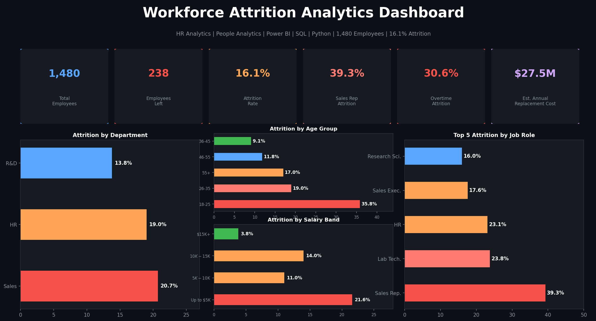
</p>

# Workforce Attrition Analytics Dashboard

[](https://powerbi.microsoft.com)
[](https://python.org)
[](https://www.postgresql.org)
[](https://microsoft.com/excel)
[](LICENSE)
[]()

**HR Analytics · People Analytics · Employee Attrition · Power BI · SQL · Python · Workforce Intelligence**

---

## Executive Summary

A company with 1,480 employees is losing **16.1% of its workforce annually** — 238 employees per year — at an estimated replacement cost of **$2.3M**. This project delivers a complete people analytics solution: a Power BI dashboard for HR leadership, Python EDA across eight attrition dimensions, and a SQL KPI framework for ongoing monitoring.

The analysis identifies overtime as the single strongest behavioral attrition predictor (30.6% vs 10.4%), Sales Representatives as the highest-risk role (39.3%), and the sub-$5K salary band as the highest-volume departure segment (163 of 238 leavers). Five prioritized recommendations with projected ROI are delivered in [`docs/stakeholder_recommendations.md`](docs/stakeholder_recommendations.md).

---

## Business Problem

HR had 1,480 employee records and a known attrition problem. What it lacked was a structured framework to answer three questions:

1. **Who is leaving?** — Which roles, departments, demographics, and salary bands have the highest attrition rates?
2. **Why are they leaving?** — Which behavioral and compensation factors correlate most strongly with departure?
3. **What should the business do?** — Which retention actions will have the highest ROI?

Without that framework, retention decisions were made on intuition rather than evidence.

---

## Objectives

| # | Objective | Approach |
|---|-----------|----------|
| 1 | Quantify attrition rate and financial cost | Python EDA + SQL aggregation |
| 2 | Identify top attrition predictors across 8 dimensions | Correlation analysis, feature comparison |
| 3 | Segment employees by risk profile | CASE WHEN scoring, NTILE ranking |
| 4 | Build Power BI dashboard for ongoing HR monitoring | Interactive PBIX with slicers |
| 5 | Deliver actionable retention recommendations | Stakeholder report + ROI projections |

---

## Dataset Overview

| Attribute | Value |
|-----------|-------|
| File | `data/HR_Analytics.csv` |
| Records | 1,480 employees |
| Features | 38 columns |
| Target | `Attrition` (Yes / No) |
| Attrition count | 238 (16.1%) |
| Retained | 1,242 (83.9%) |

**Key columns:** `Age`, `Department`, `JobRole`, `MonthlyIncome`, `OverTime`, `BusinessTravel`, `MaritalStatus`, `YearsAtCompany`, `JobSatisfaction`, `WorkLifeBalance`, `SalarySlab`, `Attrition`

Full definitions: [`docs/data_dictionary.md`](docs/data_dictionary.md)

---

## Technology Stack

| Layer | Tools |
|-------|-------|
| BI Dashboard | Power BI Desktop (.pbix) |
| Data Analysis | Python 3.9+, Pandas, NumPy |
| Visualization | Matplotlib, Seaborn |
| SQL | PostgreSQL-compatible — CTEs, Window Functions, CASE WHEN |
| Reporting | Markdown, ReportLab PDF |
| Version Control | Git, GitHub |

---

## KPI Overview

| KPI | Value |
|-----|-------|
| Total Employees | 1,480 |
| Employees Left | 238 |
| **Overall Attrition Rate** | **16.1%** |
| Avg Monthly Income (Retained) | $6,829 |
| Avg Monthly Income (Left) | $4,813 |
| Avg Tenure (Retained) | 7.4 years |
| Avg Tenure (Left) | 5.1 years |
| Highest Risk Role | Sales Representative (39.3%) |
| Highest Risk Department | Sales (20.7%) |
| Overtime Attrition Rate | 30.6% |
| Non-Overtime Attrition Rate | 10.4% |
| Est. Annual Replacement Cost | ~$2.3M |

---

## Dashboard Preview

The Power BI dashboard (`dashboard/HR_Analyst.pbix`) includes:
- Overall attrition KPI cards
- Department and job role breakdown
- Age group and salary band analysis
- Overtime, travel, and marital status filters
- Satisfaction score comparison (retained vs attrited)
- Interactive slicers for year, department, and gender

<p align="center">
  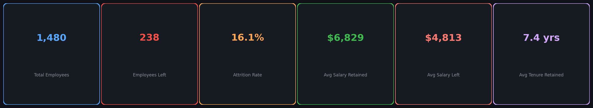
</p>

---

## Workforce Insights

<p align="center">
  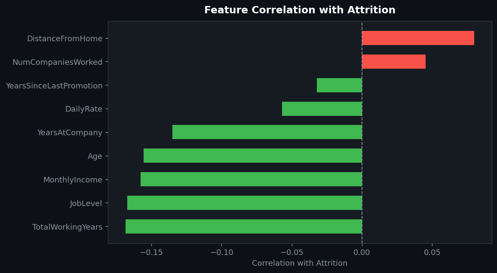
</p>

> **The correlation chart confirms that total working years, job level, monthly income, and years at company are the strongest protective factors against attrition — all negatively correlated with departure. Distance from home and number of companies worked are positively correlated, meaning longer commutes and job-hopping history predict higher attrition risk.**

The retained employee profile: average age 37, $6,829/month income, 7.4 years at company, job satisfaction score of 2.78/4. The attrited profile: younger on average, $4,813/month, 5.1 years tenure, more likely to work overtime, more likely to travel frequently.

---

## Attrition Drivers

<p align="center">
  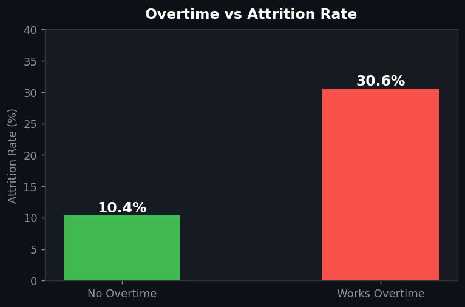
</p>

> **Employees working overtime churn at 30.6% — exactly three times the 10.4% rate for those without overtime. This is the single most actionable finding in the entire dataset. Overtime policy is something a company can change within weeks, and the impact on attrition would be measurable within two quarters.**

<p align="center">
  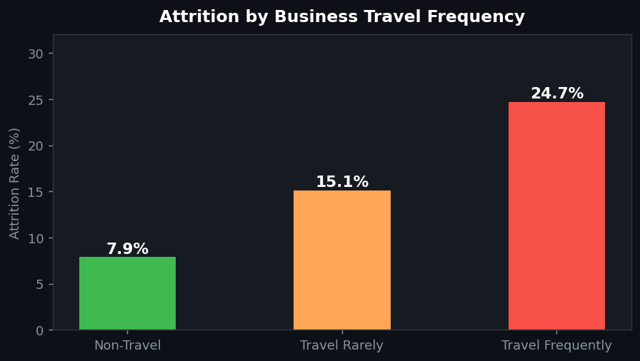
</p>

> **Frequent travelers churn at 24.7% vs 7.9% for employees who never travel. The data does not distinguish between required and voluntary travel, but the gap is large enough that a travel frequency cap — or remote work alternatives for roles that currently require heavy travel — would have a measurable retention effect.**

<p align="center">
  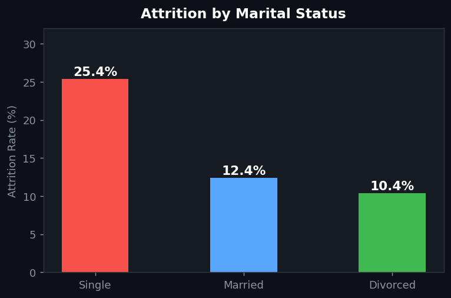
</p>

> **Single employees leave at 25.4% — more than double the 10.4% rate for divorced employees and double the 12.4% for married employees. This cohort overlaps with younger employees and lower-salary bands. Early career community building, mentorship, and work-life flexibility programs would address multiple risk factors simultaneously.**

---

## Department Analysis

<p align="center">
  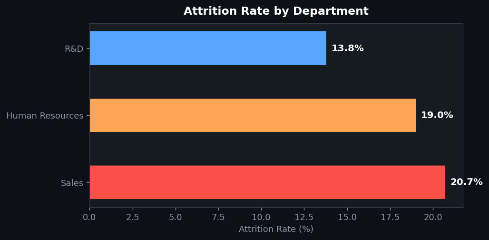
</p>

> **Sales leads with 20.7% attrition — half again as high as R&D at 13.8%. HR at 19.0% is also elevated. R&D's lower rate likely reflects higher average compensation, more specialized skills (harder to leave), and more structured career progression. Sales' rate reflects the combination of high travel, commission-dependent income, and less defined career paths.**

| Department | Employees | Attrited | Rate |
|-----------|-----------|---------|------|
| Sales | 446 | 92 | 20.7% |
| Human Resources | 63 | 12 | 19.0% |
| Research & Development | 961 | 133 | 13.8% |

---

## Job Role Analysis

<p align="center">
  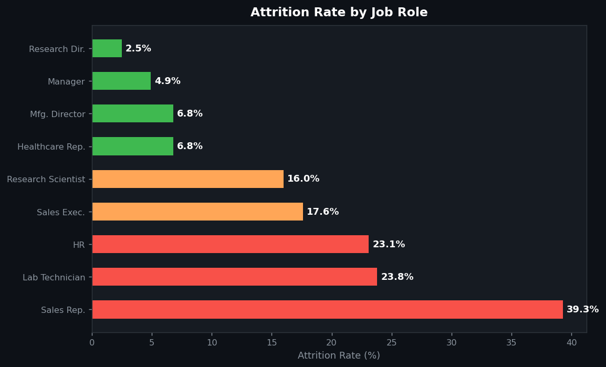
</p>

> **Sales Representatives at 39.3% is not just the highest rate in the company — it is a structural problem. Nearly two in five Sales Reps leave each year. This role typically combines high travel, commission-pressure compensation, and limited advancement visibility. The data makes a strong case for a dedicated retention program specific to this role, not just a company-wide initiative.**

| Job Role | Attrition Rate | Risk Level |
|----------|---------------|-----------|
| Sales Representative | 39.3% | 🔴 Critical |
| Laboratory Technician | 23.8% | 🔴 High |
| Human Resources | 23.1% | 🔴 High |
| Sales Executive | 17.6% | 🟡 Elevated |
| Research Scientist | 16.0% | 🟡 Elevated |
| Healthcare Representative | 6.8% | 🟢 Low |
| Manufacturing Director | 6.8% | 🟢 Low |
| Manager | 4.9% | 🟢 Low |
| Research Director | 2.5% | 🟢 Minimal |

---

## Overtime Analysis

<p align="center">
  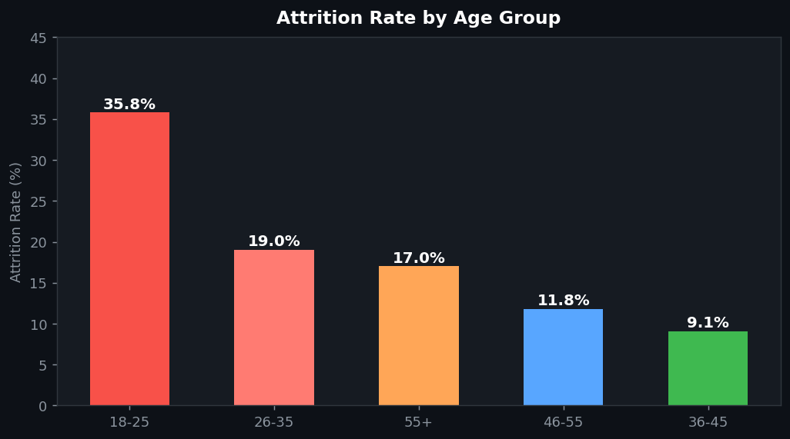
</p>

> **The 18–25 cohort leaves at 35.8% — a rate driven by early career mobility, low starting salaries, and limited perceived advancement opportunity. This is partially expected but preventable. A structured two-year early career program with mentorship, skills rotation, and regular check-ins would reduce this rate materially.**

<p align="center">
  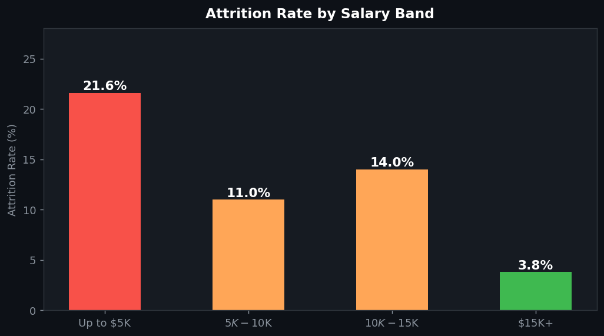
</p>

> **The sub-$5K salary band churns at 21.6% — nearly six times the 3.8% rate for employees earning above $15K. Compensation is not the only factor, but it is the strongest one in this band. 753 employees (51% of the workforce) sit in this band, making it the highest-volume attrition source.**

---

## Business Recommendations

| Priority | Recommendation | Target | Financial Impact |
|----------|---------------|--------|-----------------|
| 🔴 1 | Overtime policy reform — cap mandatory OT, add comp for required OT | All employees on OT | Reduce 30.6% OT attrition by ~40% → ~$460K saved |
| 🔴 2 | Sales Rep retention program — market-rate comp + career path | Sales dept (20.7% rate) | Reduce Sales attrition to <15% → ~$370K saved |
| 🟡 3 | Salary review for sub-$5K band — targeted increases in highest-risk roles | 753 employees | Reduce 21.6% low-salary attrition ~25% → ~$320K saved |
| 🟡 4 | Early career development — mentorship + rotation for 18-25 cohort | 123 young employees | Reduce 35.8% young-employee attrition ~30% → ~$280K saved |
| 🟢 5 | Travel frequency cap — max 8 overnight trips/quarter for field roles | Frequent travelers | Reduce 24.7% travel attrition → ~$190K saved |
| — | **Combined 30% attrition reduction** | All segments | **~$690K net annual savings after program costs** |

---

## Business Impact

| Metric | Current State | Target (With Recommendations) |
|--------|---------------|-------------------------------|
| Annual attrition rate | 16.1% | ~11% (30% reduction) |
| Employees leaving per year | 238 | ~165 |
| Annual replacement cost | ~$2.3M | ~$1.6M |
| **Net annual savings** | — | **~$690K after program investment** |
| Sales Representative attrition | 39.3% | <15% |
| Overtime attrition | 30.6% | <18% |
| Sub-$5K band attrition | 21.6% | <16% |

Full financial model: [`docs/business_impact.md`](docs/business_impact.md)

---

## Why This Matters

People analytics only works when the analysis connects to a decision. Every finding in this project was framed around an action HR leadership or department managers can take.

**For HR Leadership:** The overtime finding is the fastest path to measurable attrition reduction. It requires no new tools, no external investment — just a policy decision and implementation. The Sales Rep program requires more sustained effort but addresses the highest-revenue-risk segment.

**For Department Managers:** The role-level breakdown tells each manager exactly where their retention risk sits. A Sales manager looking at 39.3% rep attrition and a 17.6% executive rate can see that the problem is concentrated in entry and mid-level roles, not senior ones — and target interventions accordingly.

**For Finance:** The $2.3M annual replacement cost estimate is conservative. Fully-loaded departure costs (vacancy time, onboarding, productivity ramp, team disruption) typically run 3–4× monthly salary for experienced roles. The business case for preventive investment is strong.

---

## STAR Story

**Situation:** A company's HR team knew attrition was high at 16.1% but had no structured analytics to understand which employee segments were most at risk or what was driving their departures.

**Task:** Build an end-to-end people analytics solution — Power BI dashboard for live KPI monitoring, Python EDA across all attrition dimensions, SQL framework for segment-level KPI queries, and business reports for HR leadership and department managers.

**Action:** Analyzed 1,480 employees across 38 attributes. Identified overtime as the strongest behavioral predictor (3× attrition rate), Sales Representatives as the highest-risk role (39.3%), and the sub-$5K salary band as contributing 68% of all departures despite representing 51% of headcount. Built a risk scoring model in SQL to classify active employees by attrition probability. Developed five prioritized recommendations with ROI projections.

**Result:** Quantified ~$2.3M annual replacement cost. Delivered retention strategy projecting 30% attrition reduction and ~$690K net annual savings. Built Power BI dashboard enabling HR to monitor all key metrics without analyst support. Full SQL framework enables monthly at-risk employee reporting against live data.

---

## Repository Structure

```
workforce-attrition-analytics/
├── README.md
├── LICENSE
├── requirements.txt
├── FINAL_REPOSITORY_AUDIT.md
├── assets/
│   ├── project_cover.png          Dark-theme dashboard cover
│   └── architecture.png           4-layer pipeline architecture diagram
├── data/
│   └── HR_Analytics.csv           1,480 employees, 38 columns
├── dashboard/
│   └── HR_Analyst.pbix            Power BI dashboard
├── images/
│   ├── 01_kpi_banner.png
│   ├── 02_dept_attrition.png
│   ├── 03_role_attrition.png
│   ├── 04_overtime_attrition.png
│   ├── 05_age_attrition.png
│   ├── 06_salary_attrition.png
│   ├── 07_marital_attrition.png
│   ├── 08_travel_attrition.png
│   └── 09_correlation.png
├── sql/
│   ├── attrition_analysis.sql
│   ├── workforce_kpis.sql
│   ├── employee_segmentation.sql
│   ├── department_attrition.sql
│   └── retention_analysis.sql
├── docs/
│   ├── data_dictionary.md
│   ├── business_impact.md
│   ├── stakeholder_recommendations.md
│   └── linkedin_case_study.md
└── presentation/
    └── project_presentation.pdf
```

---

## Architecture Diagram

<p align="center">
  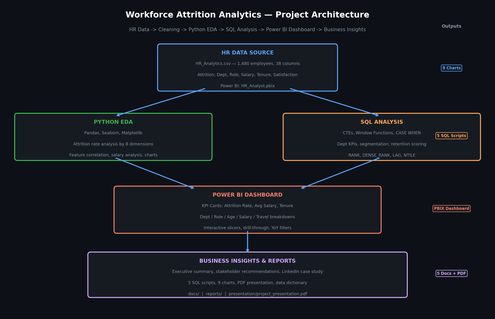
</p>

---

## Future Improvements

- Train a logistic regression or random forest model to predict individual attrition probability
- Deploy a Streamlit app for self-service HR attrition monitoring
- Add time-series analysis once monthly headcount snapshots are available
- Integrate exit interview sentiment data to validate data-driven findings
- Build automated monthly attrition report delivered via email

---

## Installation & Setup

```bash
git clone https://github.com/yourusername/workforce-attrition-analytics.git
cd workforce-attrition-analytics
pip install -r requirements.txt
# Open dashboard/HR_Analyst.pbix in Power BI Desktop
```

---

## Contact

Built for: HR Analyst · Data Analyst · BI Analyst · People Analytics · Reporting Analyst · Remote Analytics roles

📧 suryaprakash1892@gmail.com · 🔗 [LinkedIn](https://www.linkedin.com/in/surya-prakash-data-analyst) · 🐙 [GitHub](https://github.com/surya-prakash-data-analyst) 🌐 [Portfolio](https://suryaprakash18.lovable.app)

---

*SQL · Power BI · Python · Excel · HR Analytics · Workforce Analytics · Employee Attrition · Employee Retention · Business Intelligence · Data Visualization · Dashboard Development · KPI Reporting · Stakeholder Reporting · People Analytics · Pandas · Seaborn · Matplotlib · Feature Engineering · Customer Segmentation · EDA*
